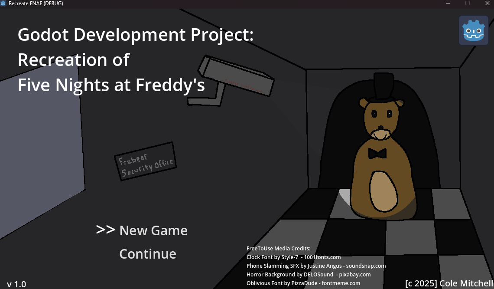
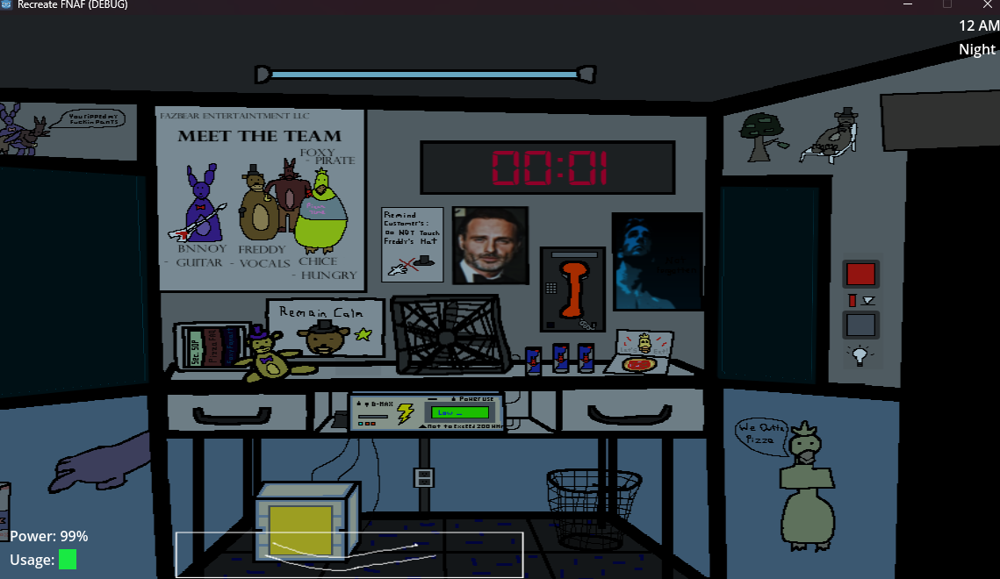
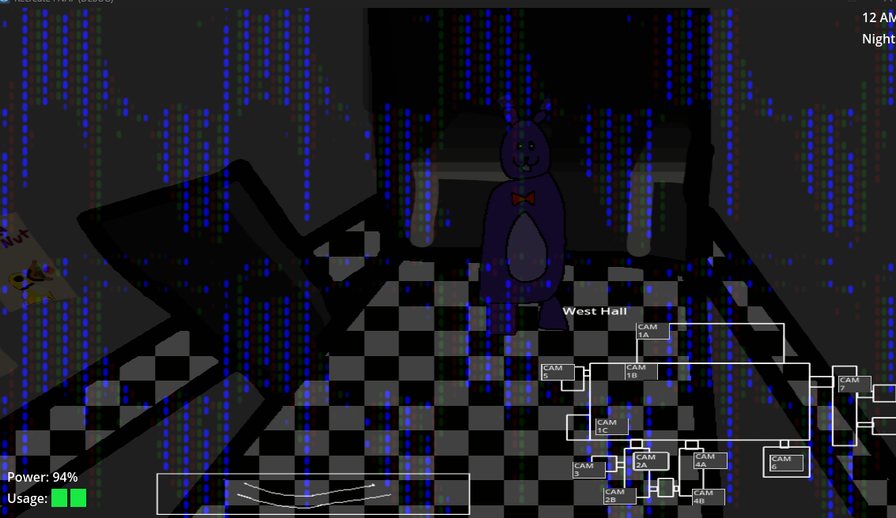
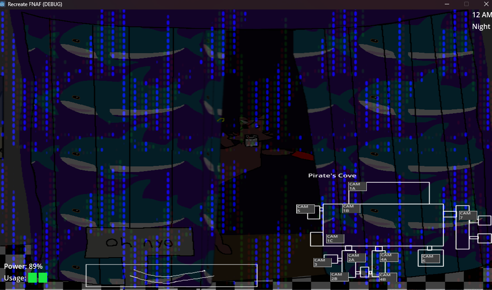

# Five Nights at Freddy's - is a game that has inspired a lot of thinking, such as this project.
<ins>This is a personal game project to recreate Five Night's at Freddy's (FNAF) in the Godot Engine as practice for amateur game making.</ins>

*I reserve no rights to FNAF or Godot.*

I selected this project thinking FNAF is a "relatively simple" game (turned out to be more complex then expected.) 
This project features one fully functional night with several endings (deaths). It launches in 1152x6487 window, no-resizing. (Maybe in a more advanced project lol)

This is the first game project I have completed.

I learned many skills during development including the production of this repository using GitHub Desktop. I will be glad to use them to better produce games in the future.

Skills include basic art skecthing using Krita, audio editing using Audactity, and learning many features in the Godot engine writing algorithmic logic with GD Script.
Godot Nodes including Controls, AnimatedSprite2D, AudioStreamPlayer, TextureRect, Timer and global concepts such as Signals, Audio Buses, and Node Properties.

**The project also includes Gachimuchi content (somewhat NSFW), open project at own discretion.**

The majority of assets are my own concept with some free-to-use assets included and credited at the Title Screen.

